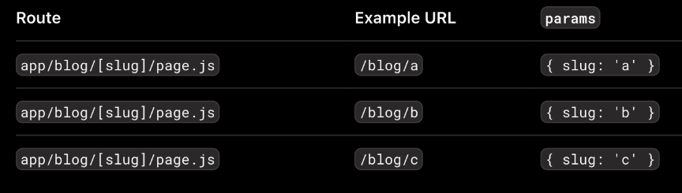

Next.js는 파일 기반 라우팅으로 파일명 설정을 통해 동적 라우팅이 가능하도록 설정할 수 있다.
page 파일을 [slug] 식의 동적 세그먼트 폴더 안에 넣어주면 라우팅이 될 때
예를 들어 blog/[slug]/page.js라고 하면 /blog/a 또는 /blog/b 등의 경로로 라우팅이 가능하다.
이때 전달 가능한 params 형태는 { slug: 'a' }, { slug: 'b' } 등이다.

