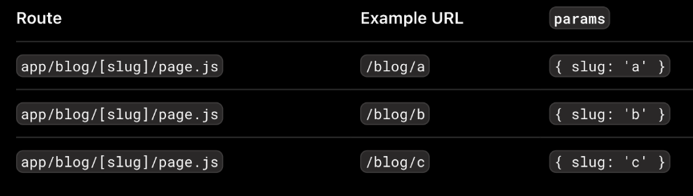

## page router

- Next.js 13 버전 이전에 있었던 방식으로 /pages 폴더에 다른 도메인 폴더를 넣어 사용한다.
- 주요한 파일로 \_app 파일과 \_document 파일이 있다.
  - \_app 파일
    - 서버로 요청이 들어왔을 때 가장 먼저 실행되는 컴포넌트
    - 페이지에 적용할 공통 레이아웃 역할 (모든 컴포넌트에 공통으로 적용할 속성 관리)
  - \_document 파일
    - \_app 파일 다음에 실행됨
    - `<head>` 등의 메타 태그나 `<body>` 태그 안에 들어갈 내용 커스텀
    - 폰트 import
    - charset, 웹 접근성 관련 태그 설정

## app router

- app 폴더에 도메인 기준으로 컴포넌트를 분류하여 넣음
- app 폴더 바로 아래에 layout 파일을 두고 메타데이터와 같은 공통으로 적용할 내용을 넣음
- 도메인 폴더 안에 페이지인 컴포넌트는 page.js 또는 page.ts로 설정하고 관련된 다른 컴포넌트와 함께 해당 도메인 폴더에 넣어 관리
