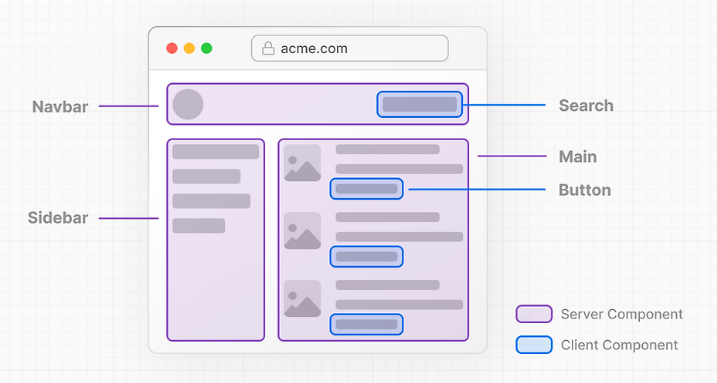

## 서버 컴포넌트란?

- 서버 컴포넌트는 서버 단에서 렌더링되는 컴포넌트
- 대부분의 컴포넌트가 서버에서 렌더링되고, 일부 인터랙티브한 UI 요소만 클라이언트에서 렌더링되는 방식
  - 여기서 '인터랙티브한 UI 요소'가 바로 클라이언트 컴포넌트

- 클라이언트 컴포넌트는 클라이언트에서 렌더링되는 컴포넌트
- 사용자와의 상호작용과 같은 애플리케이션의 인터랙티브한 부분 담당
- Next.js의 경우 서버에서 사전 렌더링되고 클라이언트에서 hydrate되어 초기 렌더링 성능 개선

> Hydrate
> 서버 단에서 렌더링된 정적 페이지와 번들링된 JS 파일(= React 코드)을 클라이언트에게 보내서 클라이언트 단에서 HTML 코드와 JS 파일을 엮는 과정

- 14 버전의 Next.js는 기본적으로 서버 컴포넌트이다.
- useState 등의 상태, 이벤트 핸들러, 브라우저 API를 쓸 때 'use client'로 클라이언트 컴포넌트로 바꿀 수 있다.
- 클라이언트 컴포넌트는 '클라이언트에서만 렌더링하겠다'는 뜻이 아니라 '(서버에서도 렌더링하고) 클라이언트에서도 렌더링하겠다'는 의미
  - 즉 정확하게는 'use client'가 아니라 'use hydrate'이 더 정확
- 서버 컴포넌트 외에 함수도 서버 함수로 만들 수 있음
  - 함수 안에 'use server'를 작성하면 fetch API 없이 데이터베이스에서 데이터를 바로 가져오는 서버 코드 작성 가능
